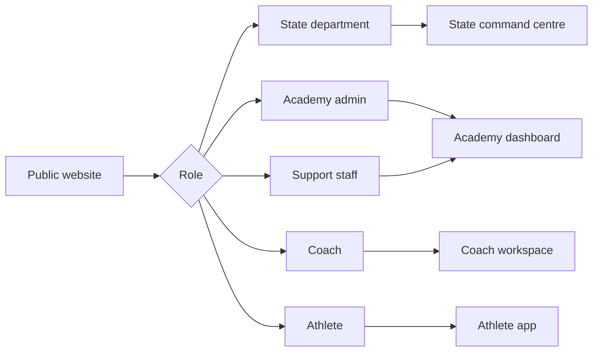
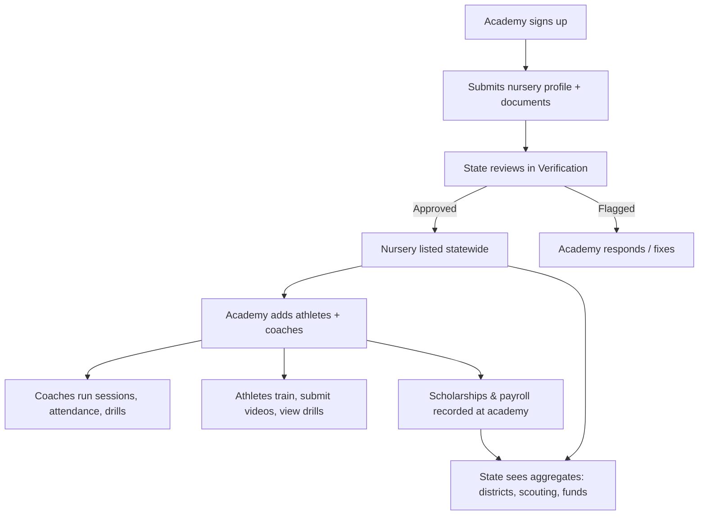
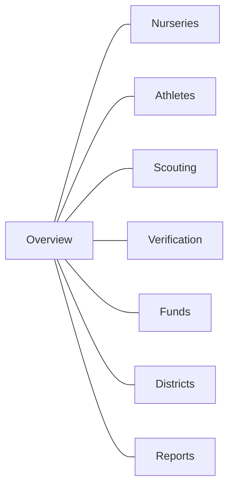
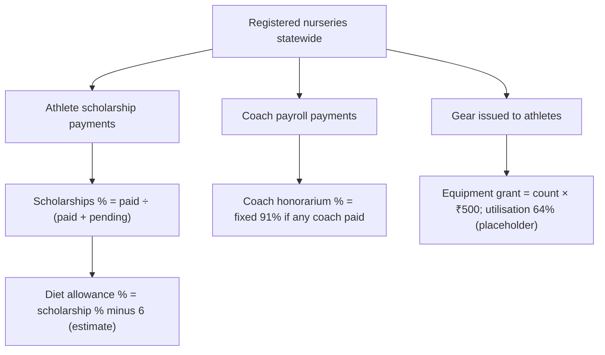

# Khel Setu — Product Progress Report

**As of:** June 12, 2026  
**Audience:** Stakeholders, operations, and programme leads (non-technical)

---

## In one minute

Khel Setu is a multi-portal sports platform for **Haryana’s state sports department**, **academy admins**, **coaches**, and **athletes**. Core day-to-day workflows—registration, roster management, attendance, verification, and talent scouting—are **live with real data**. Several **export, disbursement, and reporting buttons** are visible in the UI but **not yet functional**. Fund utilisation on dashboards uses **real scholarship payment data** mixed with **placeholder figures** for some scheme lines.

| Symbol | Meaning |
|--------|---------|
| **Live** | Users can complete the workflow today |
| **Partial** | Screen works; some actions or numbers are incomplete |
| **Planned** | Shown in UI only, or not built yet |

---

## Who signs in where

| Portal | Sign-in page | Lands on |
|--------|--------------|----------|
| State department | State login | State overview |
| Academy admin | Admin login | Academy dashboard |
| Coach | Coach login | Coach home |
| Athlete | Athlete login | Athlete home |
| New academy | Sign up → onboarding | Profile setup, then state review |

**Live:** Password sign-in, sign-up, forced password change, correct redirect per role.  
**Partial:** OTP login (screen exists; real SMS not connected).  
**Planned:** Forgot password.

---

## End-to-end programme flow

---

## State command centre (Sports Department)

| Screen | What it’s for | Live | Partial | Planned |
|--------|---------------|------|---------|---------|
| **Overview** | Statewide KPIs, district charts, verification summary, talent list, fund snapshot | Dashboards from live nursery & athlete data | Fund bars (see below); “Export report” button | — |
| **Sports nurseries** | Registry of all nurseries | List, filters, add/register, view detail, remove | — | — |
| **Athletes** | Statewide athlete roster | List, district/sport/rating filters | Only first 100 athletes loaded; “Export roster” | Search bar on other screens |
| **Talent scouting** | Shortlist athletes for programmes | Filters, update scouting status (single + bulk), download shortlist Excel/PDF | — | — |
| **Verification** | Review new academies & nursery compliance | Approve onboarding requests; verify, flag, or clear nurseries | — | — |
| **Funds** | DBT-style disbursement view | Scholarship totals from real fee payments; coach pay from payroll | Diet % derived from scholarships; coach/equipment % are placeholders; “Release funds” | Purpose-locked tokens panel |
| **Districts** | Per-district nurseries, athletes, coaches, verification | Full district table | “District report” export | — |
| **Reports** | Compliance & analytics exports | Counts if reports were generated before | “Generate report” | Scheduled exports |

### Fund utilisation — how numbers are calculated

**Takeaway for stakeholders:** Scholarship disbursement reflects **actual recorded payments**. Diet, coach utilisation %, equipment grant amounts, and “on-chain tokens” are **not yet tied to a formal state budget system**.

---

## Academy admin

| Area | Live | Partial | Planned |
|------|------|---------|---------|
| Dashboard & activity | ✓ | | |
| Players (add, edit, remove, profiles) | ✓ | Record fee from player profile (use Fees page instead) | |
| Attendance | ✓ | | |
| Fees & payroll | ✓ | | |
| Gear / inventory | ✓ | | |
| Login credentials for staff | ✓ | | |
| Coaches | Assign to sports/batches | Edit or remove coach | |
| Teams | Create team, manage roster & captain | Delete team | |
| Tournaments | View & create | Deeper tournament management | |
| Academy reports | | | Not built (no reports screen yet) |
| Academy settings | | Edit profile after onboarding | |

---

## Coach portal

| Area | Status |
|------|--------|
| Home & assignments | **Live** |
| Player list & details | **Live** |
| Attendance (own batches) | **Live** |
| Teams | **Live** |
| Review athlete video submissions | **Live** |
| Post & publish drills | **Live** |

---

## Athlete portal

| Area | Status |
|------|--------|
| Home feed | **Live** |
| Explore drills & athletes | **Live** |
| Submit training videos | **Live** |
| Drill library | **Live** |
| AI form analysis | **Partial** — UI and scores; limited analysis backend |
| Progress tracking | **Planned** — not built yet |
| Profile editing | **Partial** |

---

## What works well today

- Academy onboarding → state verification → nursery goes live on the state registry  
- State-wide visibility: nurseries, districts, verification queue, scouting pipeline  
- Academy operations: rosters, attendance, fees, gear, credentials  
- Coach workflow: drills, reviews, attendance, teams  
- Athlete workflow: feed, explore, submit, drills  
- Scouting shortlist export (Excel/PDF) for programme teams  

---

## Known gaps (visible but not finished)

| Gap | Where users see it |
|-----|-------------------|
| Export overview / roster / district reports | State header buttons |
| Release funds | State → Funds |
| Generate scheduled reports | State → Reports |
| Purpose-locked benefit tokens | State → Funds (right panel) |
| Global search in state header | Most state screens (works on Scouting only) |
| Forgot password | All login screens |
| Real OTP / SMS login | Login screens |
| Full state budget & scheme allocations | Funds dashboards |

---

## Recommended next priorities

1. **Exports** — Overview, athlete roster, and district PDF/Excel downloads  
2. **Funds model** — Real allocations for diet, equipment, and coach schemes (replace placeholders)  
3. **Reports** — Generate and schedule from the report catalog  
4. **State search** — One search bar working across nurseries, athletes, verification  
5. **Auth** — Forgot password and live OTP  
6. **Academy polish** — Coach removal, team deletion, academy settings  

---

## Demo & pilot data

Dashboards are meaningful when nurseries, athletes, fee payments, and payroll exist in the system (Haryana pilot seed). Empty screens are expected on a fresh install until academies onboard and record transactions.

**Pilot note:** Demo environments may only include a **subset** of planned nurseries (e.g. ~20 of 110). Statewide totals and district coverage will look sparse until the full pilot seed is loaded. One academy (`ambala-1`) is set up with full depth for end-to-end demos.

---

*For technical implementation detail, see `WORKLOG.md` and `docs/sign-in-portals.md`.*
